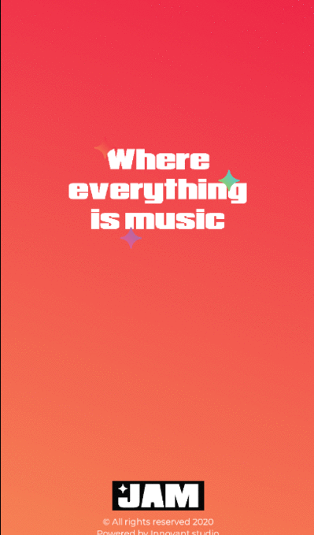

<b><a href="https://jammusic.space/">WEBSITE</a> :point_right:</b>

<b><a href="https://play.google.com/store/apps/details?id=com.innovant.jam
">DOWNLOAD APP</a> :point_right:</b>

    

    

 

### What is JAM ?

> **JAM** is a social network for musicians, music enthusiast, and individuals who are interested in music. **JAM** provides a centered platform to enhance connectivity between the musical community and fast reliable online way to organize jam sessions and musical workshops.

:link: https://jammusic.space/

    

</img>

### Walkthrough

- [x] Discover JAMS & workshops to participate in :partying_face:
- [x] Connect & Chat :envelope:
- [x] Engage with musicians :couple:
- [x] Explore fun people & fun JAMS :postbox:
- [x] Express Yourself :thinking:	

### How to get started using JAM ?

1.  Download the App :point_right: [link](https://play.google.com/store/apps/details?id=com.innovant.jam)
2.  Create an account
3.  Join Events and Search for musicians
4.  Enjoy :v:

### Supported platforms

- [Android](https://play.google.com/store/apps/details?id=com.innovant.jam)

<h6>&nbsp;</h6>
 
 

## Features

> JAM let you **meet musicians**, **create Jams & Workshops**, **participte**, **express your opinoin**, & more...

  

    
    
    
    

    
    
    
    

## Team

    <table><tr><td align="center"><a href="https://twitter.com/AhmNouira"> <b>Ahmed Nouira</b></a> <a href="https://github.com/ahmnouira/" title="Code">💻</a><a href="#" title="Ideas">🤔</a></td><td align="center"><a href="#"> <b>Aymen Fezai</b></a> <a href="https://github.com/aymensmurf" title="Code">💻</a></td></tr>
    </table>
    
Made with :sparkling_heart: by [InnovAnt.studio][innovant] team, from :tunisia:
 
    
:copyright: 2020

[ahmnouira]: http://github.com/ahmnouira
[innovant]: https://innovant.studio/
[link]: https://play.google.com/store/apps/details?id=com.innovant.jam
