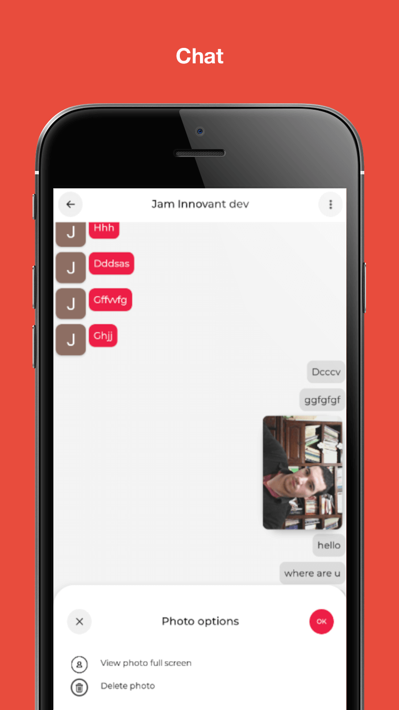

<b><a href="https://jammusic.space/">WEBSITE</a> :point_right:</b>

<b><a href="https://play.google.com/store/apps/details?id=com.innovant.jam
">DOWNLOAD APP</a> :point_right:</b>

    

    

 

### What is JAM

> **JAM** is a social network for musicians, music enthusiast, and individuals who are interested in music. **JAM** provides a centered platform to enhance connectivity between the musical community and fast reliable online way to organize jam sessions and musical workshops.

## JAM is now available on Android.

:link: https://jammusic.space/

    
    @aymensmurf   

</img>

### Walkthrought

- [x] Discover JAMS & workshops to participate in. :couple:
- [x] Connect & Chat :envelope:
- [x] Engage with musicians
- [x] Explore fun people & fun JAMS :postbox:
- [x] Express Yourself

### How to get started using JAM ?

- Download the App :point_right: [link](https://play.google.com/store/apps/details?id=com.innovant.jam)
- Create an account
- Join Events and Search for musicians
- Enjoy :v:

### Supported platforms

- [Android](https://play.google.com/store/apps/details?id=com.innovant.jam)

<h6>&nbsp;</h6>

## Features

> JAM let you **meet musicians**, **create Jams & Workshops**, **participte**, **express your opinoin**, & more...

    
    &nbsp;&nbsp;&nbsp;&nbsp;
    
    &nbsp;&nbsp;&nbsp;&nbsp;
    

    
    &nbsp;&nbsp;&nbsp;&nbsp;
    
    &nbsp;&nbsp;&nbsp;&nbsp;
    

    
    &nbsp;&nbsp;&nbsp;&nbsp;
    
    &nbsp;&nbsp;&nbsp;&nbsp;
    

## Team

Made with :sparkling_heart: by [InnovAnt.studio][innovant] team :tunisia: :copyright: 2020

<table><tr><td align="center"><a href="https://twitter.com/AhmNouira"> <b>Ahmed Nouira</b></a> <a href="#" title="Code">💻</a><a href="#" title="Ideas">🤔</a></td><td align="center"><a href="#"> <b>Aymen Fezai</b></a> <a href="#" title="Code">💻</a></td></tr>
</table>

[ahmnouira]: http://github.com/ahmnouira
[innovant]: https://innovant.studio/
[link]: https://play.google.com/store/apps/details?id=com.innovant.jam
